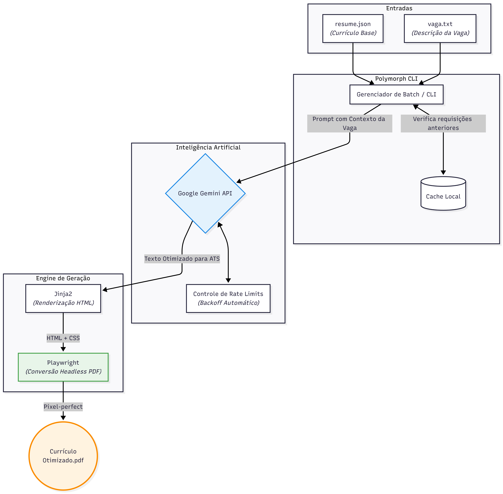

### 🎯 Polymorph

**Automação CLI com IA para personalização inteligente de currículos em PDF**

O Polymorph é uma CLI que utiliza a API do Google Gemini para adaptar automaticamente o seu currículo base para os requisitos exatos de múltiplas vagas de emprego, renderizando PDFs profissionais e "pixel-perfect" em **menos de 30 segundos**.

Candidatar para dezenas de vagas com o mesmo currículo genérico é o erro mais comum no mercado. O Polymorph resolve isso: lê as descrições das vagas, usa IA para reescrever suas experiências com as palavras-chave certas e gera arquivos prontos para sistemas ATS (Applicant Tracking Systems) — tudo via linha de comando.

---

####  Arquitetura e Fluxo de Dados

O sistema foi projetado para suportar processamento em lote (batch) de forma resiliente, com cache em disco e controle automático de limite de requisições (rate limits) para a API da inteligência artificial.

---

####  Funcionalidades

* **IA Contextual com Google Gemini:** O modelo lê a descrição da vaga e reescreve o resumo e as experiências do currículo para destacar exatamente o que o recrutador está procurando, sem inventar informações — apenas reorganizando e enfatizando o que já existe.
* **PDF Engine com Playwright + Jinja2:** Nada de bibliotecas PDF limitadas. O currículo é renderizado como HTML via Jinja2 e convertido em PDF pelo Playwright (Chromium headless), garantindo suporte a CSS moderno e renderização idêntica ao navegador.
* **Processamento em Lote (Batch):** Tem 20 vagas para aplicar? Coloque os arquivos `.txt` em uma pasta e rode um único comando. O Polymorph processa todas em sequência.
* **Cache Inteligente:** Vagas similares não consomem tokens desnecessários. O sistema de cache evita chamadas redundantes à API e reduz custo de uso.
* **Resiliência a Rate Limits:** Backoff automático no caso de Rate Limit da API do Gemini — o processamento em lote não quebra no meio da execução.

---

#### 💻 Comandos

| Comando | Flag | Descrição |
| ------ | ------ | ------ |
| `apply` | — | Processa uma única vaga interativamente |
| `batch` | `--jobs-dir` | Processa todos os `.txt` de um diretório em lote |
| `apply` / `batch` | `--resume` | Usa um arquivo JSON de currículo alternativo |
| `apply` / `batch` | `--skip-ai` | Gera PDF sem chamar a API (modo offline) |

---

####  Como Rodar Localmente

**Pré-requisitos**
* Python 3.10+
* Chave de API do Google AI Studio (gratuita)

**Passo a Passo**
1. Clone o repositório: `git clone https://github.com/Dom1ng0s/polymorph.git`
2. Instale as dependências: `pip install -r requirements.txt`
3. Instale os binários do Playwright: `playwright install chromium`
4. Crie um arquivo `.env` na raiz e adicione sua chave de API: `GEMINI_API_KEY=sua_chave_aqui`
5. Edite o arquivo `inputs/resume.json` com suas informações base.
6. Rode a CLI: `python polymorph.py apply` ou `python polymorph.py batch --jobs-dir ./inputs`

---

#### 🛠 Stack Tecnológica

| Responsabilidade | Tecnologia |
| ------ | ------ |
| **Linguagem** | Python 3.10+ |
| **IA / LLM** | Google Gemini API |
| **Geração de PDF** | Playwright (Chromium headless) |
| **Templating** | Jinja2 |
| **CLI** | argparse |
| **Config** | python-dotenv |

---

####  Roadmap (Próximas Evoluções)

- [ ] Suporte a múltiplos templates de PDF (Moderno, Clássico, Acadêmico)
- [ ] Integração com outros LLMs (OpenAI, Anthropic, Llama 3 local)
- [ ] Extração automática de vagas via URL (LinkedIn / Indeed)
- [ ] Interface Web com Streamlit para usuários não-técnicos

---

####  Autor
**Davi Domingos de Oliveira**  
Estudante de Ciência da Computação — UFAL | Backend Developer
